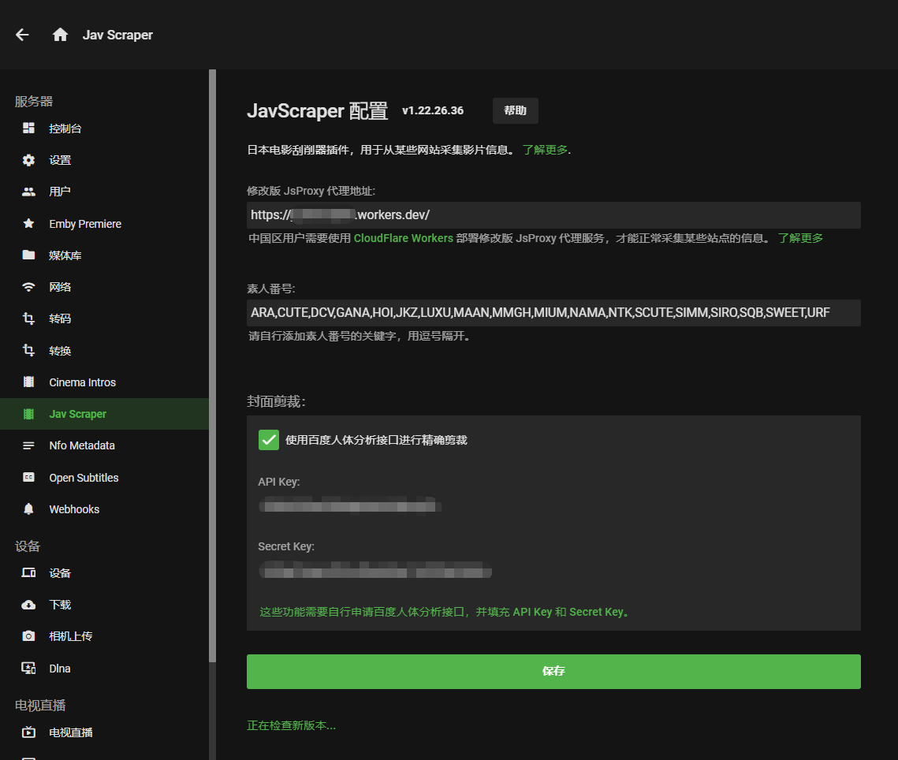

# Emby.Plugins.JavScraper
Emby 的一个日本电影刮削器插件，可以从某些网站抓取影片信息。

[https://javscraper.com](https://javscraper.com)

# 主要原理
- 通过在 [CloudFlare Worker](https://workers.cloudflare.com) 上架设的**修改版 [jsproxy](https://github.com/EtherDream/jsproxy)** 作为代理，用于访问几个网站下载元数据和图片。
- 安装到 Emby 的 JavScraper 刮削器插件，根据文件名找到番号，并下载元数据和图片。

# 支持的采集来源
- [JavBus](https://www.javbus.com/)
- [JavDB](https://javdb.com/)
- [MsgTage](https://www.mgstage.com/)
- [FC2](https://fc2club.com/)
- [AVSOX](https://avsox.host/)
- [Jav123](https://www.jav321.com/)

# 如何使用

## 部署修改版 jsproxy
具体参见[使用 CloudFlare Worker 免费部署](cf-worker/README.md)
> 默认已经配置了一个代理，多人使用会超过免费的额度，建议自己配置

## 插件安装
- [点击这里下载最新的插件文件](https://github.com/JavScraper/Emby.Plugins.JavScraper/releases)，解压出里面的 **JavScraper.dll** 文件，通过ssh等方式拷贝到 Emby 的插件目录
- 常见的插件目录如下：
  - 群晖
    > /volume1/@appstore/EmbyServer/releases/\{VERSION}/plugins

    其中的 `{VERSION}` 以已安装的版本为准，最新的为 `4.3.1.0`
  - Windows
    > emby\programdata\plugins
- 需要**重启Emby服务**，插件才生效。

## 插件更新
- 打开 **JavScraper** 配置页面的时，会自动检查更新（在页面的最下方）。
- 如果有更新，则点击**立即更新**，并在**重启 Emby Server** 后生效。

## 配置
- 在**插件** 菜单中找到 **Jav Scraper**，点击进去，配置你自己的 jsproxy 地址。
- 在**媒体库**中，找到你的日本电影的媒体库，并编辑：
    - 媒体库类型必须是**电影** 
    - 打开高级设置
    - 在 **Movie元数据下载器** 中只 勾选 **JavScraper**
    - 在 **Movie图片获取程序** 中只 勾选 **JavScraper**

## 使用
- 点 **刷新元数据** 或者 在 **识别** 中输入番号查找。

## 其他建议
- Emby 自动搜索元数据的时候，会将非根文件夹的名称作为关键字，所以，需要非根文件夹名称中包含番号信息。
- 如果自动搜索元数据失败或者不正确时，请使用 **识别** 功能手动刷新元数据 或者 修改文件夹、文件名称后再重试。

# 计划新增特性
- [x] 支持某些域名不走代理
- [x] 支持禁用代理
- [x] 支持移除某些标签
- [ ] 标签从日文转为中文
- [ ] 翻译影片简介
- [ ] 刮削器支持排序
- [ ] 刮削器支持重新指定网站的域名

# 截图

